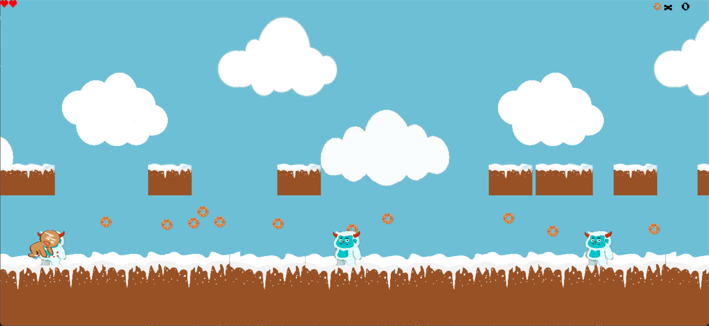

[](https://classroom.github.com/a/F62_0SL3)
[](https://classroom.github.com/online_ide?assignment_repo_id=10907938&assignment_repo_type=AssignmentRepo)
# Cookie Chase


Este projeto é um jogo desenvolvido por Laura Pontiroli e Rafaela Afférri como um projeto em dupla para para a disciplina Developer Life do primeiro semestre da graduação em Ciências da Computação no Insper. O jogo foi desenvolvido em python utilizando a biblioteca Pygame. Este projeto foi desenvolvido em um período de 2 semanas e conta também com site produzido no mesmo período e para a mesma disciplina. O site pode ser acessado através do seguinte link [https://insper-classroom.github.io/devlife-23-1-projeto-pygame-laura_e_rafaela/](https://insper-classroom.github.io/devlife-23-1-projeto-pygame-laura_e_rafaela/)

## Descrição do Jogo

O jogo consiste de um personagem principal Dough Boy, um biscoito de gengibre, que precisa coletar o máximo de cookies possíveis. Dough Boy corre automaticamente, sendo o papel do jogador fazer ele pular para coletar os cookies e desviar ou acertar os monstros de neve. O jogador inicia o jogo com 3 vidas e pode perde-las conforme ele é acertado pelos monstros, após ter coletado um certa quantidade de cookies, caso o jogador não morra antes do esperado, o jogo acaba e é mostrado a quantidade de pontos feitos pelo jogador (que dependem da quantidade de monstros acertados, o tempo demorade e a quantidade de vida restante).

## Como Baixar o Jogo

Para poder jogar é nescessario ter instalado no seu computador os seguintes items:

- Pyhton 3
- Pygame

Para instalar o pygame digite o seguinte comando no seu terminal:

```
pip install pygame
```

Após realizado a instalação dos items acima é necessario fazer o dowload do jogo, para tal há dois caminhos:

1. Primeira opção
    1. Acesse o site do jogo pelo seguinte link [https://insper-classroom.github.io/devlife-23-1-projeto-pygame-laura_e_rafaela/bora_jogar.html](https://insper-classroom.github.io/devlife-23-1-projeto-pygame-laura_e_rafaela/bora_jogar.html) 
    2. Clique no icone de dowload
        
        
        
2. Segunda opção
    1. Acesso a página do jogo no github atravéz do seguinte link https://github.com/insper-classroom/devlife-23-1-projeto-pygame-laura_e_rafaela]
    2. Clique no botão verde escrito ‘code’ ou ‘código’
        
        
        
    3. Clique no botão ‘Dowload Zip’

Após a execução do dowload abra a pasta na sua IDE de preferencia e execute o arquivo Jogo_GM.py

## Como jogar

- O jogador irá se movimentar para a direita automaticamente
- Você deverá  usar a tecla de espaço para pular e a tecla de seta para baixo para descer mais rapidamente
- Seu objetivo é conseguir o máximo de pontos possiveis, para isso você deve:
    - Coletar os cookies o mais rápido, basta passar com o personagem por cima deles para coleta-los
    - Atingir o maior número de mosntros que puder, você atingi os monstros quando pula em cima deles proposicionalmente, não basta apenas cair da platorforma em cima deles
    - Terminar o jogo com o maior número de vidas
- Se você atingir o monstro da neve horizontalmente, ou após cair em de uma plataforma, você perderá uma vida
    
    
    
- O jogo acaba após um certa quantidade de cookies for coletados e então será mostrado o total de pontos feitos por você

